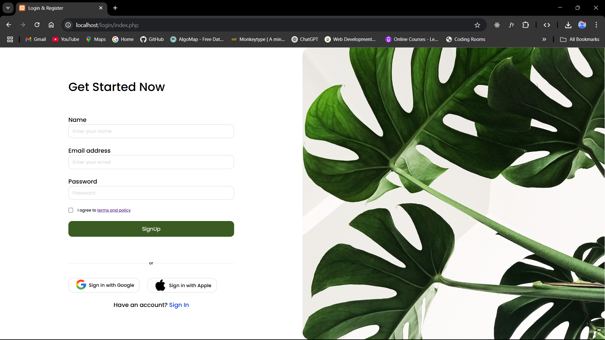
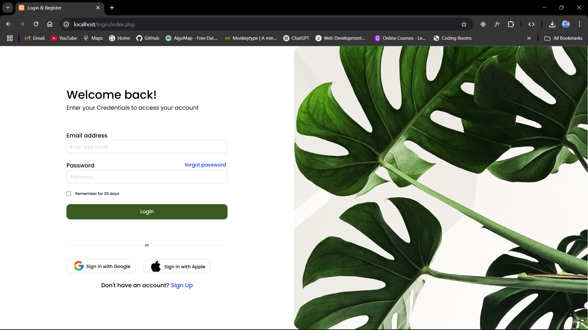

# 💻 Task 2 | Mainflow |   PHP Login & Registration System with MySQL

A responsive and secure login/signup system built with **PHP**, **MySQL**, and **HTML/CSS**, designed to provide a modern UI and solid backend structure. It includes features like hashed passwords, SQL injection prevention, session-based authentication, and a smooth user experience.

---

## 🔥 Features

- 👤 User Registration
- 🔐 Secure Login with hashed passwords (`password_hash`)
- 🚫 SQL Injection Protection (prepared statements)
- 🛡️ Session-based Access Control
- 💡 Clean, responsive UI using Flexbox & Google Fonts
- 🖼️ Image-based layout for modern design feel
- 📱 Mobile and Desktop Responsive

---

## 🗃️ Folder Structure

```
project-root/
│
├── css/
│   └── style.css               # Custom styles
│
├── images/
│   └── (logos/backgrounds)     # UI assets (e.g., Google, Apple, backgrounds)
│
├── connect.php                 # MySQL database connection script
├── index.php                   # Frontend login/signup form
├── register.php                # Handles form submission & logic
├── homepage.php                # Landing page after successful login
├── logout.php                  # Clears session and logs out user
└── README.md                   # This documentation file
```

---

## 🛠️ Setup Instructions

### 1. Requirements
- PHP 7.4+
- MySQL
- XAMPP/WAMP/LAMP or any local server setup

### 2. Clone the Repository
Place the folder in your local server directory (e.g., `htdocs` for XAMPP).

### 3. Create the MySQL Database

Go to [phpMyAdmin](http://localhost/phpmyadmin) and run:

```sql
CREATE DATABASE login;
USE login;

CREATE TABLE users (
  id INT AUTO_INCREMENT PRIMARY KEY,
  username VARCHAR(100) NOT NULL,
  email VARCHAR(100) NOT NULL UNIQUE,
  password VARCHAR(255) NOT NULL
);
```

### 4. Configure Database Connection

Open `connect.php` and ensure these match your local setup:

```php
$host = "localhost";
$user = "root";
$pass = "";
$db = "login";
```

---

## 🚀 Running the Project

1. Start your Apache & MySQL from XAMPP/WAMP.
2. Visit `http://localhost/your-folder-name/index.php`
3. Sign up with new credentials and test login.

---

## 🖼️ Screenshots

### Signup Form


### Login Form


---

## 🔐 Security Considerations

- Passwords are hashed using `password_hash()` before saving to the database.
- Inputs are sanitized using **prepared statements** to prevent SQL injection.
- Login logic uses `password_verify()` for authentication.
- Session variables are used to maintain login state securely.

---

## 💡 Technologies Used

| Stack      | Tech                             |
|------------|----------------------------------|
| Frontend   | HTML5, CSS3 (Flexbox), Google Fonts |
| Backend    | PHP                              |
| Database   | MySQL                            |
| Server     | Apache (via XAMPP/WAMP)          |

---

## 📄 License

This project is free to use and modify for educational or personal projects.

---

## 📬 Contact

If you face any issues or want to contribute:
**Ritesh Verma** – [riteshvermamt@gmail.com]
