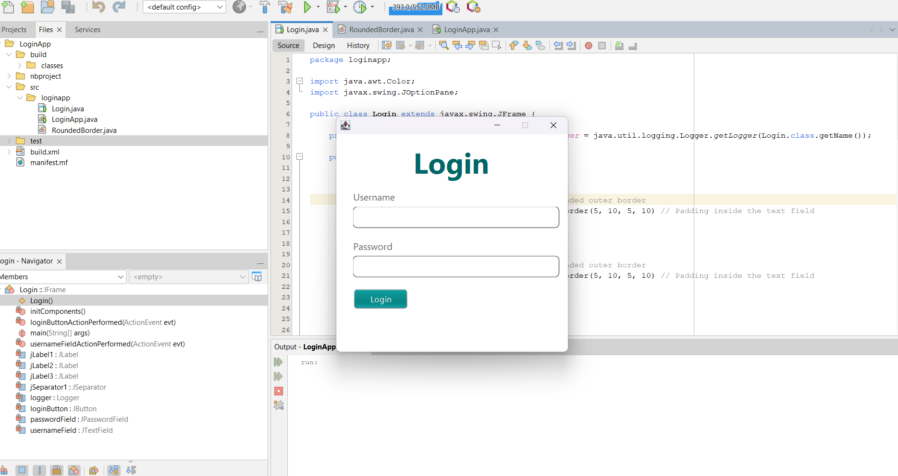

# Task 3: Design the Login Page Using NetBeans IDE (Design Window)

This is **Task 3** of the `mainflow-task` repository. It contains a simple login screen built using **Java Swing** and designed in **NetBeans IDE**.

## 🖥️ UI Snapshot
### Login Form


## 📁 Folder Structure

```
task3/
├── nbproject/       → NetBeans configuration files
├── src/
│   └── loginApp/
│       └── Login.java
├── build.xml        → NetBeans build script
└── README.md        → This file
```
